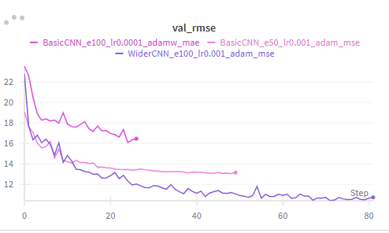
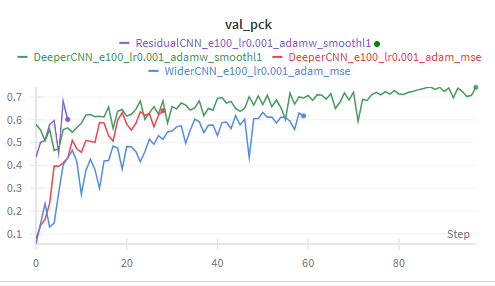
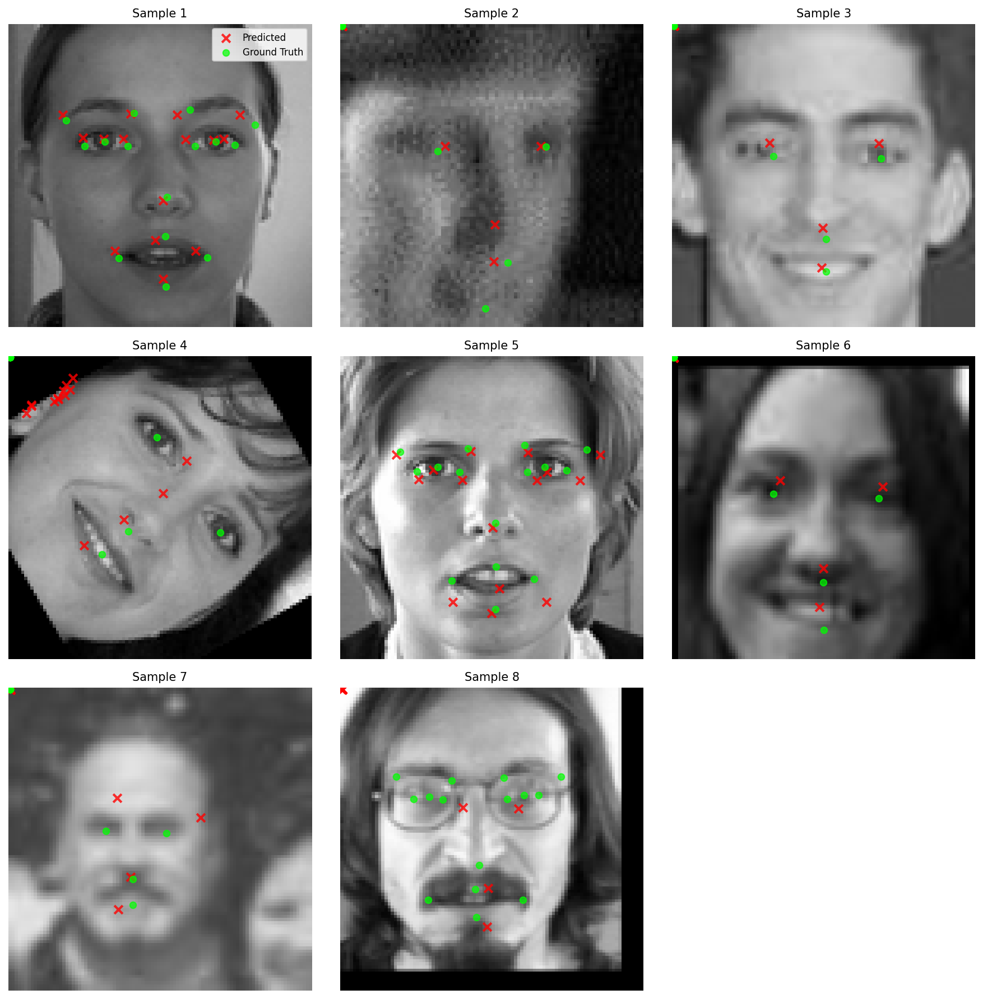

# ZNEUS-25-FacialKeypoints

## Dataset
Facial Keypoints Detection: [Kaggle Link](https://www.kaggle.com/c/facial-keypoints-detection/data)

### Retrieving Images
Data given as sequence of numbers representing pixels of images. These images can be retrieved by running [script](genImages.py) using `python genImages.py`.

## Experiments
### Moderate Augmentation
First set of experiments we conducted on moderately augmented dataset. By the moderate augmentation we mean rotation of the images with angle is in (-30; +30).

We started with BasicCNN model and lr=0.0001 (adam opt + MSE loss), however model could not converge, therefore we decided to use greater lr=0.001 (adam opt + MSE). Model converged, but after 30 epochs started to overfit and was stopped with the early stopping.

We decided to switch to the WiderCNN model and keep same hyperparameters. This model showed improvement in both MAE and RMSE metrics.

### Severe Augmentation
After inferencing model on test part of the dataset, we noticed that model still did not learn actual features, therefore we decided to increase rotation of the images in augmentation part, so it learns forms, not approximate locations of keypoints.

As well as new augmentation, we added two more metrics to better understand how well our models perform. Those metrics are PCK and NME.

We started our second set of experiments with the same WiderCNN and same parameters. However, model was overfitting and never reached level of the MAE on moderately augmented data. We concluded, it could not learn shapes anyway.

To address this issue, we switched to the DeeperCNN and kept other hyperparameters same. This improved PCK by 5%, but model was still prone to the overfitting. Hence, we added L2 optimization and decided to switch SmoothL1 loss (to address issues with outliers, which were not properly handled). This further improved PCK by another 10%, however it took model 100 epochs to generalize.

Now, to address the issue of slow convergence, we added skip layers (residual network) and re-trained our models.

Final results are on the graph below:

Final inference of the best model:
